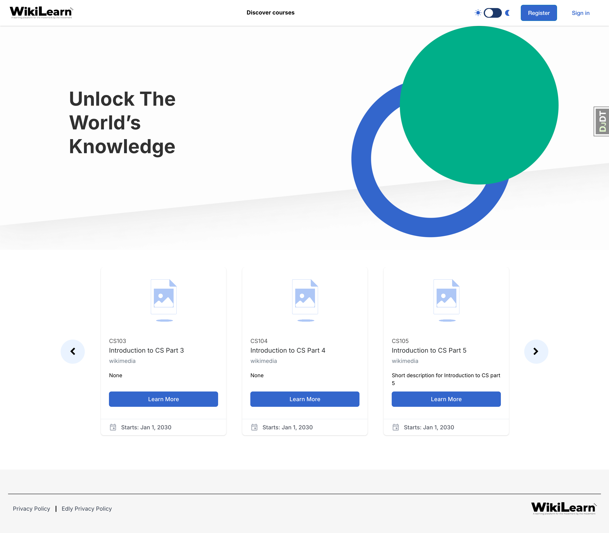

Wikilearn Indigo Theme
======================

The **Wikilearn Indigo** theme is a refined and customized version of the Open edX Indigo theme, tailored specifically for Wikilearn.
It is based on the original `Tutor Indigo <https://github.com/overhangio/tutor-indigo>`__ theme.

Wikilearn Customisations
========================

Details
-------
- Updated UI
   - Converted the course card list in ``courses.html`` to a carousel.
   - Added course descriptions to the course cards in ``course.html``.
- Global layout changes
   - Restyled headers across the LMS and MFEs.
   - Customized footers for the LMS, Studio, and MFEs.
- Certificate styles
   - Added new certificate styling and layout.

     - Linked certificate styles in ``accomplishment-base.html``.
     - Structural and styling updates in ``_accomplishment-rendering.html``.
     - Changed the default sans-serif font to Montserrat for a modern look.
